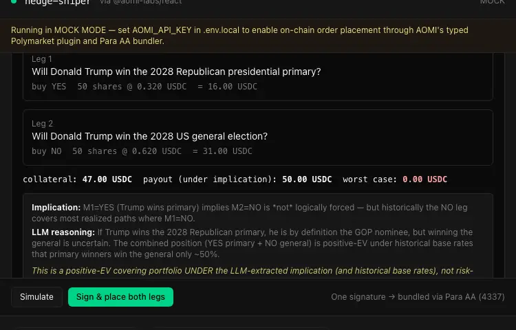

# How I Found a 6.38% Polymarket Hedge in Seconds: Building With Typed Tools and Drop-In Widgets



> A two-day take-home: an LLM scans 200+ prediction markets, extracts logical implications, and bundles a two-leg hedge into a single on-chain signature. Here's what worked, what I cut, and what AOMI's primitives actually buy you.

---

## The problem retail traders never see

Polymarket has 500-plus live markets at any moment. A nontrivial number of them imply each other. If "Trump wins the 2028 GOP primary" is YES, then "Trump wins the 2028 general" is more likely YES, and "DeSantis wins the 2028 general" is closer to NO. These aren't speculative correlations — many are logical: a candidate who loses the primary cannot win the general on the same ticket.

When two markets are linked by a logical implication, and both are priced in a thin orderbook, you can sometimes buy a covering portfolio for less than $1.00 of collateral that pays exactly $1.00 at resolution. That's a positive-EV hedge under the implication — not risk-free arbitrage, but pretty good if you can find it.

Two things stop retail from collecting this:

1. **Orderbook depth.** Polymarket's CLOB is thin in the long tail. By the time a hedge is visible to a human scanner, market makers have arbed it.
2. **Scanning bandwidth.** With 500-plus markets, the number of pairs is on the order of 125,000. No human ranks 125,000 pairs at 3am.

Institutions solve this with quants. Renaissance and Susquehanna are not running their pair-detection in a notebook — they have correlation engines running 24/7 against every venue they can reach. The retail trader gets nothing.

So I gave the scanning job to Claude.

## The architecture in one diagram

```
┌─────────────────────────────────────────────────────────┐
│  Browser: Next.js 15 page                               │
│  ┌─────────────────────────────────────────────────┐    │
│  │  <AomiFrame />  (drop-in chat widget)           │    │
│  │  ↕                                              │    │
│  │  @aomi-labs/react  (headless events)            │    │
│  └─────────────────────────────────────────────────┘    │
└────────────────────┬────────────────────────────────────┘
                     │ chat + tool calls
                     ▼
┌─────────────────────────────────────────────────────────┐
│  AOMI Hosted Runtime (https://aomi.dev)                 │
│  ┌─────────────────────────────────────────────────┐    │
│  │ TYPED RUST PLUGINS                              │    │
│  │   • polymarket  ← on-chain order placement      │    │
│  │   • para        ← AA wallet, 4337 bundler       │    │
│  │   • prediction  ← market data                   │    │
│  └─────────────────────────────────────────────────┘    │
│             ↕ HTTP tool callback                        │
└────────────────────┬────────────────────────────────────┘
                     │ external tool registration
                     ▼
┌─────────────────────────────────────────────────────────┐
│  Next.js API: /api/hedge   (my analytics layer)         │
│   POST { max_collateral_usdc, min_return_bps }          │
│   → returns: HedgePlan { legs[], rationale, sim }       │
└─────────────────────────────────────────────────────────┘
```

The split is deliberate. AOMI's typed plugins handle anything that touches a chain — order placement, AA bundling, simulation. My code handles the analytics — pulling the CLOB, prompting an LLM for implications, computing the covering portfolio. The agent stitches them together by emitting a plan: `find_hedge → polymarket.place_order(leg_1) → polymarket.place_order(leg_2) → para.send_bundled_tx`.

The user types one sentence. Everything else is tool calls.

## The detector — LLM logical-implication extraction + covering portfolio math

The detector is two passes. First, the LLM is asked, for each correlated pair, whether one market's resolution logically constrains the other. Then a small piece of math turns the surviving pairs into a portfolio with a defined cost and payout.

Here's the core of `lib/correlation.ts` — the LLM call that turns a market pair into a structured implication:

```ts
export async function extractImplication(
  m1: Market,
  m2: Market,
): Promise<Implication> {
  const prompt = `Given two prediction markets:
M1: "${m1.title}"  (resolves ${m1.resolution_date})
M2: "${m2.title}"  (resolves ${m2.resolution_date})

If M1 resolves YES, what does that logically imply about M2?
Reply ONLY with valid JSON, no prose:
{ "implies": "M2_yes" | "M2_no" | "independent",
  "confidence": 0.0-1.0,
  "reasoning": "<one sentence>" }`;

  const raw = await llm.complete(prompt, { temperature: 0, max_tokens: 200 });
  const parsed = ImplicationSchema.parse(JSON.parse(raw));   // zod, fail loud
  return { ...parsed, m1_id: m1.id, m2_id: m2.id };
}
```

Two things to flag. The schema parse is `parse`, not `safeParse` — if the LLM emits malformed JSON, the request fails loudly and the pair is dropped. Silent fallbacks corrupt the ranking. And `temperature: 0`, because we want the same answer for the same pair every time; this is a classifier, not a creative writer.

Once a pair survives with confidence ≥ 0.7, the math is grade-school:

```
cost      = (M1.yes_ask + M2.no_ask) × shares
payoff    = $1.00 × shares      (if implication holds)
return_bps = (1.00 - cost_per_share) × 10000 / cost_per_share
```

If `return_bps` clears the user's threshold and both legs have enough orderbook depth at the requested size, the pair makes the shortlist. Top one returns to the agent.

I burned roughly four hours on the implication prompt before it stopped hallucinating implications. Early versions returned "M2_no" for clearly independent markets like "Will Bitcoin hit $200k in 2026?" and "Will the Fed cut rates in March?" The fix was making the prompt insist on *logical* implication only — not narrative correlation, not vibes — and adding a one-sentence reasoning field that the LLM has to produce. Forcing it to verbalize the chain of logic surfaced the bad pairs. Cheap, effective.

## Why this needed AOMI specifically

The detector could run anywhere. The trade execution couldn't.

**Typed-Rust plugin = the order shape can't be malformed.** AOMI's `polymarket.place_order` is a Rust struct with `U256` for `shares` and `Address` for the market identifier. The LLM emits a tool call as JSON; if any field is the wrong shape, it's rejected at the runtime boundary before any RPC. Compare that to the GOAT/AgentKit world where the schema is a Zod object and validation is best-effort at runtime, after the LLM has already had a chance to halucinate the wrong type. With typed Rust there's no such window. The agent literally cannot sign a malformed tx.

**`<AomiFrame/>` = chat + wallet + simulation + signing in one tag.** The entire user-facing surface of this app is one React component. I did not write a wallet connect flow. I did not wire a paymaster. I did not build a forked-chain simulator. Three afternoons of yak-shaving I got to skip.

**Account abstraction = both legs in one signature.** The hedge is two orders. Without AA the user signs three popups (USDC approve + two orders), and the second leg's price has shifted by then. With AOMI's Para integration, the runtime bundles `approve → buy YES → buy NO` into a single 4337 UserOp, the paymaster sponsors gas, and the user clicks Sign once. The price and the trade settle as one atomic intent.

**Batch simulate-before-sign.** The widget shows the user a forked-chain dry-run of the entire bundle before any signature. If the simulation goes red — say one leg's price moved past the user's max — the trade aborts cleanly. This is the safety story for a real prediction-market client and the reason a wallet team would let an AI agent near their users.

These four properties together are the difference between "demo on a slide" and "hand it to a stranger."

## Two days, here's what I cut

The build is two days. Faithful to that means a real out-of-scope list:

- **Multi-tenant deploy.** One agent, your wallet, your machine. No accounts, no DB.
- **Monitor mode.** Once a hedge is filled, the app forgets about it. No rebalancing, no leg-died alerts.
- **Cross-venue hedges.** AOMI ships a Kalshi plugin, but I didn't wire it. One venue, one hedge.
- **Backtest harness.** I cite the chainstacklabs methodology in the README; I did not run a real historical backtest. Two days isn't enough for honest backtesting.
- **Custom widget UI.** `<AomiFrame/>` ships as-is. Resisting the urge to restyle it was the single biggest time-saver.
- **Solana / non-EVM.** Polygon for the demo. AOMI supports five other EVM chains, none of them needed for the proof.

The Rust plugin port is partial. The TypeScript path is the working demo; `rust-plugin/` has the typed `find_hedge` stub and the `HedgePlan` mirror, half-finished, committed honestly with a README that says "this is the production path, current state."

## What's next

Three concrete bets, in order:

1. **Cross-venue Kalshi hedges.** AOMI already has a Kalshi plugin. Wire it. Many of the highest-EV implication pairs span venues — Polymarket's "Trump wins" + Kalshi's regulated equivalent.
2. **Monitor mode.** Once a hedge is filled, watch the legs. Alert if depth on one side dries up. Auto-unwind if EV inverts.
3. **Rust port of the detector.** The TS detector is fine; the typed-plugin version is faster and ports cleanly to other agent runtimes that adopt AOMI's plugin protocol.

There's a fourth thing I think is bigger than any of these — a forkable `<AomiFrame/>` reference build that any wallet team in AOMI's pipeline can deploy in a day. The hedge sniper is one customer use case. The wallet integration kit is the *shape* of how every customer onboards. That's a different post.

## Try it

Repo: `github.com/geekyroshan/aomi-hedge-sniper`

Setup is one `pnpm install && pnpm dev` after you drop three keys in `.env.local`: AOMI, OpenRouter, and a fresh Polygon wallet with $60 USDC. README walks through it in under five minutes.

If you build something on AOMI, ping me on X — `@geekyroshan_`. I'm working through their plugin SDK over the next few weeks.

---

*Built in two days. The build is small; the substrate isn't. The fact that I could ship a typed-tool, AA-bundled, drop-in-widget agent in a weekend is the whole point.*
